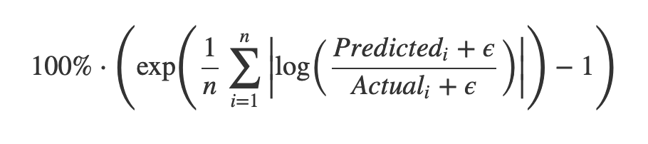
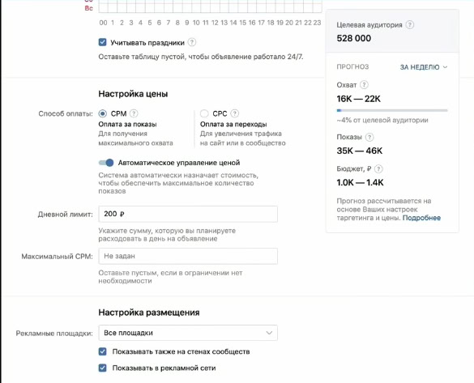

## Предсказание количества просмотров рекламы

## Команда: 

- Бахурин Виктор

- Воронцов Илья

- Нам Алина

- Стахова Екатерина

## Цель проекта: 

Разработать модель для прогнозирования охвата рекламных объявлений (доли
пользователей, увидевших объявление хотя бы 1, 2, 3 раза) на основе
исторических
[данных](https://cloud.mail.ru/public/kdLW/T574PctKb)
аукциона ВКонтакте, на которых приоритет объявления определяется ставкой
(cpm) и сессией пользователя.

## Желаемый образ результата:

Веб-сервис(автобиддинг)

### 1. Предварительный анализ данных:

1.  Изучить особенности данных:

    a.  Рассчитать основные статистики для вещественных и категориальных признаков

    b.  Есть ли пропущенные значения.

    c.  Есть ли выбросы в данных

2.  Изучить поведение признаков и визуализировать их распределения. Посмотреть на корреляции.

3.  Построить сводные таблицы и диаграммы.

4.  Проанализировать полученные результаты.

5.  Технологии и инструменты: seaborn, matplotlib и т.п.

### 2. Реализация моделей и методов: 

Для решения задачи предлагается следующий подход:

1.  Построить бейзлайн — Linear regression и оценить результат с помощью метрики.

2.  Использование более сложных моделей для решения задачи, параллельно feature engineering и validation:

    a.  Деревья решений.

    b.  Случайный лес

    c.  Бустинг(XGBoost, Feature gain)

    d.  Другие решения

3.  Технологии и инструменты: scikit-learn, XGBoost и т.д.

### 3. Реализация веб-сервиса: 

1.  Реализовать автобиддинг, похожего на тот, что у VK
    
2.  Технологии и инструменты: FastAPI, Docker и т.д.
